# 

# 

# 

Configuration Manager

User Guide

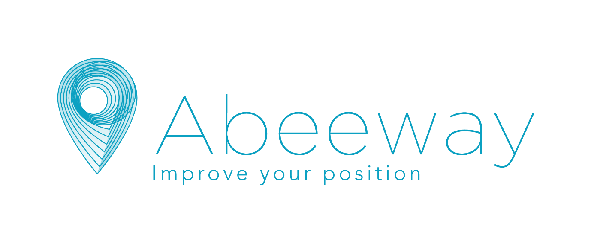

# Summary

[I. Introduction [4](#introduction)](#introduction)

[I.1. Document purpose
[4](#i.1.-document-purpose)](#i.1.-document-purpose)

[I.2. Glossary [4](#i.2.-glossary)](#i.2.-glossary)

[II. Purpose of Configuration Manager
[5](#purpose-of-configuration-manager)](#purpose-of-configuration-manager)

[III. Structure of the Tool
[5](#structure-of-the-tool)](#structure-of-the-tool)

[III.1. Parameter Set and Configuration
[5](#iii.1.-parameter-set-and-configuration)](#iii.1.-parameter-set-and-configuration)

[III.1.1. Parameter Set
[5](#iii.1.1.-parameter-set)](#iii.1.1.-parameter-set)

[III.1.2. Configuration
[6](#iii.1.2.-configuration)](#iii.1.2.-configuration)

[III.2. Hardware and Firmware
[6](#iii.2.-hardware-and-firmware)](#iii.2.-hardware-and-firmware)

[III.3. Device [6](#iii.3.-device)](#iii.3.-device)

[III.3.1. Device state and Device history
[6](#iii.3.1.-device-state-and-device-history)](#iii.3.1.-device-state-and-device-history)

[III.3.2. Tagging [7](#iii.3.2.-tagging)](#iii.3.2.-tagging)

[IV. Using Configuration Manager
[8](#using-configuration-manager)](#using-configuration-manager)

[IV.1. Authentication and Permission
[8](#iv.1.-authentication-and-permission)](#iv.1.-authentication-and-permission)

[VI.1.1. Login [8](#vi.1.1.-login)](#vi.1.1.-login)

[VI.1.2. Access the Configuration Manager from the Abeeway Portal
[9](#vi.1.2.-access-the-configuration-manager-from-the-abeeway-portal)](#vi.1.2.-access-the-configuration-manager-from-the-abeeway-portal)

[VI.1.3. Organization [9](#vi.1.3.-organization)](#vi.1.3.-organization)

[VI.1.3. Permission [10](#vi.1.3.-permission)](#vi.1.3.-permission)

[IV.2. Navigation [11](#iv.2.-navigation)](#iv.2.-navigation)

[IV.2.1. Abeeway Portal
[11](#iv.2.1.-abeeway-portal)](#iv.2.1.-abeeway-portal)

[IV.2.2. Configuration Manager Tabs
[11](#iv.2.2.-configuration-manager-tabs)](#iv.2.2.-configuration-manager-tabs)

[IV.2.3. Buttons and Links
[12](#iv.2.3.-buttons-and-links)](#iv.2.3.-buttons-and-links)

[IV.2.4. Folding menu
[13](#iv.2.4.-folding-menu)](#iv.2.4.-folding-menu)

[IV.3. Select Firmware to use
[13](#iv.3.-select-firmware-to-use)](#iv.3.-select-firmware-to-use)

[V. Set up a Parameter Set
[14](#set-up-a-parameter-set)](#set-up-a-parameter-set)

[V.1. Creating a Parameter Set, a Group and a Physical Parameter
[14](#v.1.-creating-a-parameter-set-a-group-and-a-physical-parameter)](#v.1.-creating-a-parameter-set-a-group-and-a-physical-parameter)

[V.2. Link between the Parameter Set and a Configuration
[15](#v.2.-link-between-the-parameter-set-and-a-configuration)](#v.2.-link-between-the-parameter-set-and-a-configuration)

[V.3. Physical Parameter Type
[16](#v.3.-physical-parameter-type)](#v.3.-physical-parameter-type)

[V.4. Logical Parameter and Enumeration
[16](#v.4.-logical-parameter-and-enumeration)](#v.4.-logical-parameter-and-enumeration)

[VI. Set up a Configuration
[18](#set-up-a-configuration)](#set-up-a-configuration)

[VI.1. Locked and unlocked Configuration
[18](#vi.1.-locked-and-unlocked-configuration)](#vi.1.-locked-and-unlocked-configuration)

[VI.2. Configuration form scratch and inherited
[18](#vi.2.-configuration-form-scratch-and-inherited)](#vi.2.-configuration-form-scratch-and-inherited)

[VI.3. Apply a Configuration
[19](#vi.3.-apply-a-configuration)](#vi.3.-apply-a-configuration)

[VII. Device management [20](#device-management)](#device-management)

[VII.1. Register a new Device
[20](#vii.1.-register-a-new-device)](#vii.1.-register-a-new-device)

[VII.2. Check the Device state and the Device history
[20](#vii.2.-check-the-device-state-and-the-device-history)](#vii.2.-check-the-device-state-and-the-device-history)

[VIII. Using Serial and Bluetooth
[21](#using-serial-and-bluetooth)](#using-serial-and-bluetooth)

[VIII.1. Using the Serial and Bluetooth interface
[21](#viii.1.-using-the-serial-and-bluetooth-interface)](#viii.1.-using-the-serial-and-bluetooth-interface)

[VIII.2. Connect a Device through Serial
[22](#viii.2.-connect-a-device-through-serial)](#viii.2.-connect-a-device-through-serial)

[VIII.3. Connect a Device through Bluetooth
[22](#viii.3.-connect-a-device-through-bluetooth)](#viii.3.-connect-a-device-through-bluetooth)

[VIII.4. Using the CLI
[23](#viii.4.-using-the-cli)](#viii.4.-using-the-cli)

[VIII.5. Check for Configuration and update the device state
[23](#viii.5.-check-for-configuration-and-update-the-device-state)](#viii.5.-check-for-configuration-and-update-the-device-state)

[VIII.6. Import / Export the device configuration
[24](#viii.6.-import-export-the-device-configuration)](#viii.6.-import-export-the-device-configuration)

# Introduction

## I.1. Document purpose

This document explains the goal of the Configuration Manager (ConfMan)
application and how to use it. It addresses to the Abeeway team and to
person managing AT3 devices.

## I.2. Glossary

| ConfMan | The acronym of Configuration Manager |
|----|----|
| AT3 | Asset Tracker 3, a new version of Firmware for Abeeway Tracker |
| Parameter Set | It defines all configurable parameters that represent a specific device |
| Physical Parameter | The name given in the tool for AT3 configuration parameter |
| Configuration | A configuration regroups all the values of Physical parameter |

# Purpose of Configuration Manager

The aim of the Configuration Manager, as the name suggests, is to
control the configuration of a wide range of AT3 devices. Each device
registered in the tool has a known state, that make able to follow the
configuration loaded in the device.

When the device sends a frame, it verifies that the configuration loaded
matches the most up to date configuration in the tool for this specific
device. If not, it automatically sends LoRaWAN frames to update the
device configuration.

The tool is able to manage many firmware version and configuration
depending on the AT3 product type.

# Structure of the Tool

## III.1. Parameter Set and Configuration

### III.1.1. Parameter Set

A Parameter Set defines all the parameters that represent a specific AT3
product, it is the skeleton that specifies each parameter. All of them
are divided into groups, that represent a certain functionality domain.

We use 4 entities to describes the skeleton of a AT3 product:

- **Parameter Set**, representing the specific product (e.g. Compact
  Tracker).

- **Groups**, representing a certain number of parameters that have the
  same functionality domain (e.g. System Core).

- **Physical** **Parameter**, representing AT3 configuration parameters
  in the documentation (e.g. Core Monitoring Period).

- **Logical Parameter**, that are linked to a certain Physical
  Parameter, representing the specific values possible for more complex
  parameters (e.g. Button Mapping).

With easier words, a Parameter Set is a AT3 products, it contains Groups
and each of them contains Physical Parameters. More complex Physical
Parameter are linked to Logical Parameters.

<figure>
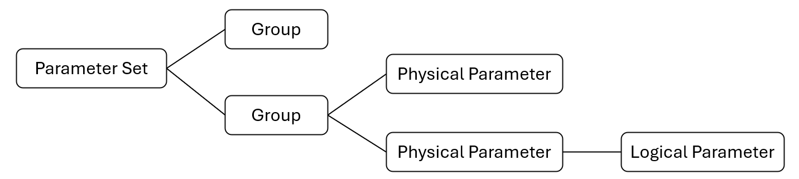
<figcaption>
Figure 1: structure of a Parameter Set
</figcaption>
</figure>

The aim of a Parameter Set is to describe and specify a range of
Physical Parameters, such as their name, their description, their type,
their range and at which group they belong. **It is not about giving to
them a value**, this is made with the Configuration.

### III.1.2. Configuration

When a Parameter Set is defined, we can then apply a value for each
Physical Parameters described in it, that is the goal of a
Configuration. For a Parameter Set, we can have as many Configurations
as wanted.

## III.2. Hardware and Firmware

To recognize a AT3 device, we can use the Hardware and the Firmware. The
Hardware represents the type of the AT3 product, when the Firmware
represents the binary code loaded into it. For example: a device named
ABW006W1.0.0 represent the first version of a Compact Tracker. When
asking for configuration, we can know the Firmware loaded, for example:
“AT3 : 1.2-0” is the Firmware version.

By linking a pair of Hardware and Firmware to a Parameter Set, when a
device communicates, the Configuration Manager will associate this
device to a Parameter Set, and so to a list of Configuration.

## III.3. Device

### III.3.1. Device state and Device history

The device state memorizes all the needed information to follow the
Configuration over the time. It registers the Hardware and Firmware of
the device to be linked to the Parameter Set and save 2 important
information:

- the **Current Configuration**, loaded in the device.

- the **Target Configuration**, the most up to date configuration
  according to the Configuration Manager.

The Configuration is defined by the user with tags.

<figure>
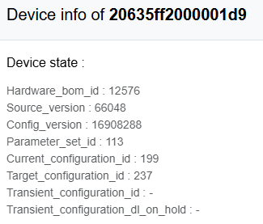
<figcaption>
Figure 2 : device state
</figcaption>
</figure>

### III.3.2. Tagging

Two elements can be tagged in the tool: Configurations and Devices. To
link a Configuration to a specific device, the Hardware and Firmware
information of the device must correspond to a Parameter Set. If in this
Parameter Set one of the Configuration has the same tags as our device,
this configuration will be considered as the Target Configuration, the
configuration that is wanted.

<figure>
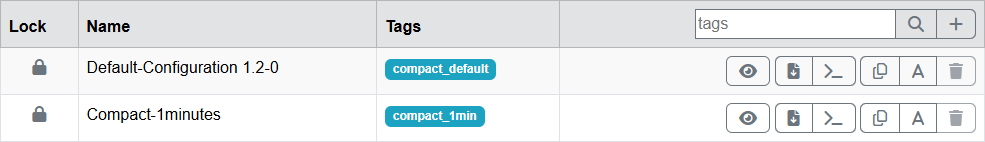
<figcaption>
Figure 3 : Configuration for Compact
Tracker
</figcaption>
</figure>

If the device isn’t tagged or the tag does not correspond to a
Configuration of this Parameter Set, the default Configuration
registered for this specific Hardware and Firmware will be applied.

<figure>
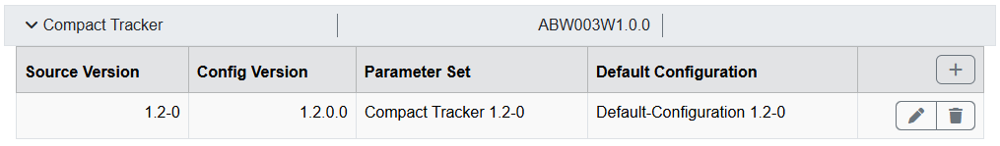
<figcaption>
Figure 4 : Default Configuration
</figcaption>
</figure>

In the Figure 2, we can see that our device has different Configuration
between the Current and the Target. The configuration 199 is the default
configuration for Compact Tracker, and the Configuration 237 is the one
with the same tag of our device.

<figure>
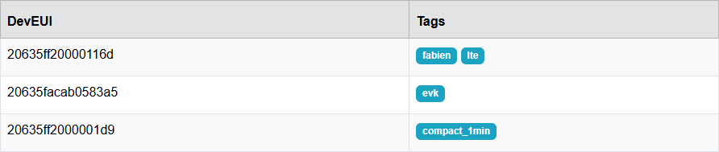
<figcaption>
Figure 5 : Device with Tags
</figcaption>
</figure>

Because the Target and the Current Configuration are not the same, at
the next uplink of the device, the tool will find the difference between
the two Configuration and send downlinks to apply the Configuration
“1minute”. Changing the Configuration could take several downlinks. When
the Configuration send by the device will match the Target Configuration
in the tool, that mean that the update is done. The tool will change the
device state to move the Target Configuration to the Current
Configuration.

# Using Configuration Manager

## IV.1. Authentication and Permission

### VI.1.1. Login

When you connect for the first time or when you previously logout from
the Abeeway Portal, you will be redirected to the identity service:

<figure>
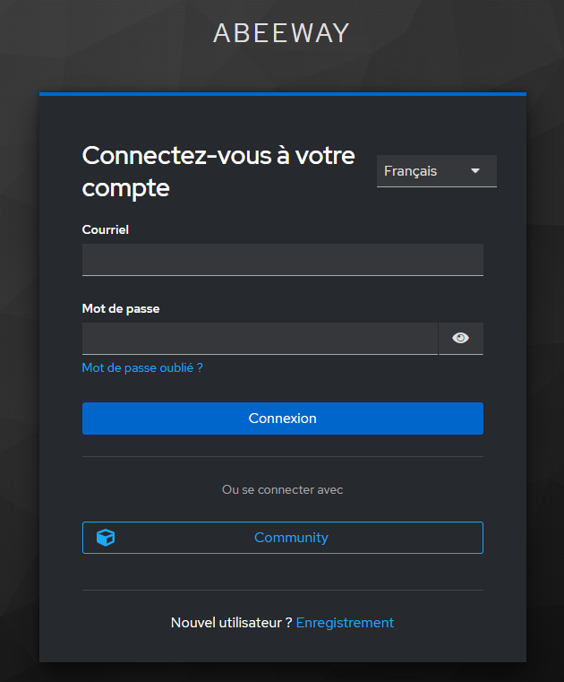
<figcaption>
Figure 6 : Login interface
</figcaption>
</figure>

You can login to your account or register a new one. You can logout from
the Abeeway Portal from the **Navbar**.

### VI.1.2. Access the Configuration Manager from the Abeeway Portal

Once logged on the Abeeway Portal, you can use different tools, you can
access them by clicking on the **Navbar -\> Tools**, or directly from
the home page using the **link**.

<figure>
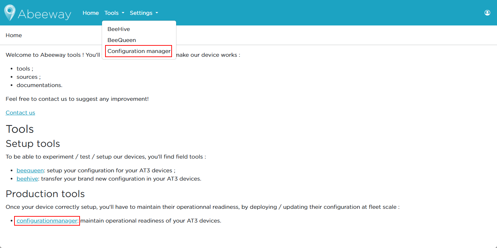
<figcaption>
Figure 7 : Abeeway Tools
</figcaption>
</figure>

### VI.1.3. Organization

Authenticated users are always linked to an organization, this makes
possible to share data between users from the same organization. Some of
them may have multiple organization, in this case you can switch your
organization from the **Navbar**:

<figure>
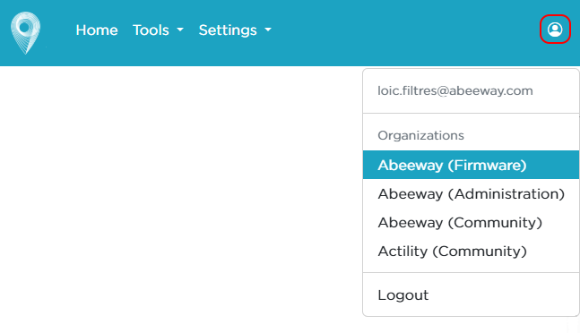
<figcaption>
Figure 8 : Switch organization
</figcaption>
</figure>

### VI.1.3. Permission

Rights on the Abeeway Portal and on the Configuration Manager are
different between users. An administrator of an organization can creates
User Profile to adapt permissions (**Navbar** -\> **Settings** -\>
**User profiles** -\> **+ New**):

<figure>
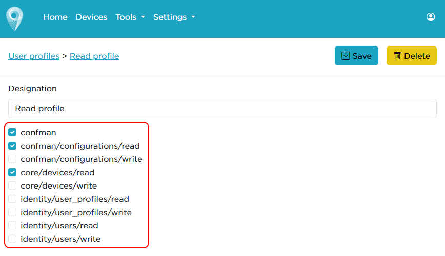
<figcaption>
Figure 9 : Creating a User Profile
</figcaption>
</figure>

Then you can affect this profile to a user account (**Navbar** -\>
**Settings** -\> **User** -\> **Profile**):

<figure>
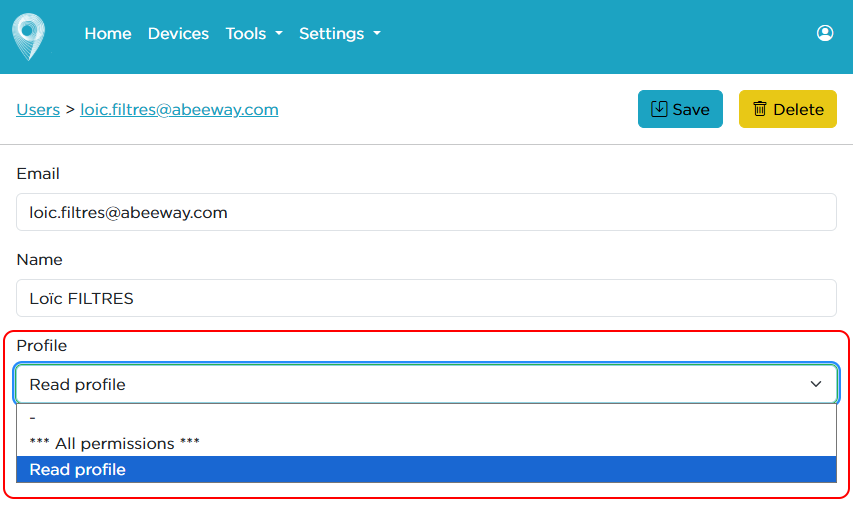
<figcaption>
Figure 10 : Affecting a User Profile
</figcaption>
</figure>

Changing Configuration Manager permissions on users will adapt the view
like the examples below:

<figure>
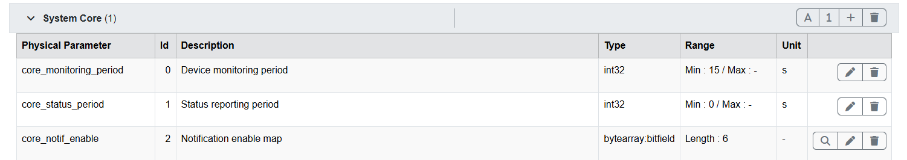
<figcaption>
Figure 11 : User with permission
</figcaption>
</figure>

<figure>
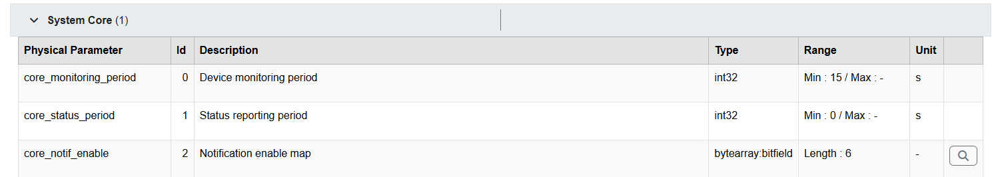
<figcaption>
Figure 12 : User without permission
</figcaption>
</figure>

## IV.2. Navigation

### IV.2.1. Abeeway Portal

Once logged on the Abeeway Portal, you can access to different tabs
using the **Navbar** on top of the page:

<figure>

<figcaption>
Figure 13 : Abeeway Portal Navbar
</figcaption>
</figure>

1.  Return to the Abeeway Portal home page

2.  Access the device list linked to the organization

3.  Access to the different tools: BeeQueen, BeeHive, Configuration
    Manager

4.  Set up Users and MQTT Connectors for the organization

5.  Manage the different organizations

6.  Access user information, log out and switch organization

### IV.2.2. Configuration Manager Tabs

From the home page, you can travel between 5 main tabs:

- **Device Management**, where you can register all your devices and tag
  them.

- **Firmware Selector**, where you can select the Firmware that you use
  to display only needed information.

- **Configuration and Parameters**, where you can create Parameter Set
  and Configurations

- **Serial Connection**

- **Bluetooth Connection**

The navigation is summarized in the next figure:

<figure>
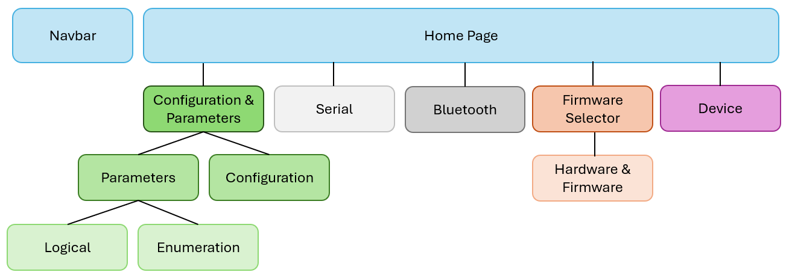
<figcaption>
Figure 14 : Navigation in Configuration
Manager
</figcaption>
</figure>

### IV.2.3. Buttons and Links

On the Configuration Manager pages, you can see on the top right of the
page a Back Button to travel to the previous page:

<figure>
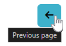
<figcaption>
Figure 15 : Back Button
</figcaption>
</figure>

For buttons that only contain a symbol, you can display a text box
specifying what they are doing by moving the mouse on top of it, you can
also do the same on links:

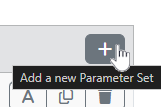
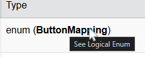

Figure 16 : Highlight on buttons and links

### IV.2.4. Folding menu

For user readability, some menu such as Groups or Bitfield Parameter can
be hidden or shown by clicking on a down
arrow: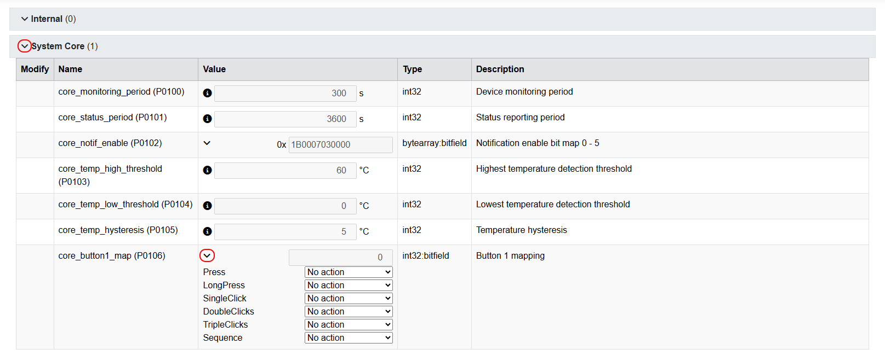

Figure 17 : Folding menu

## IV.3. Select Firmware to use

To simplify the user interface and the data showed, you can specify
which Firmware you want to use. Firmware selected in this page will make
visible the Parameter Set linked to it in the **Configuration and
Parameter** page.

From the home page, go to **Firmware**. From here you can access to a
list containing different versions, that are grouped by device type. You
can select Firmwares by clicking the checkbox, it will update data shown
for Parameter Set and Configuration.

<figure>
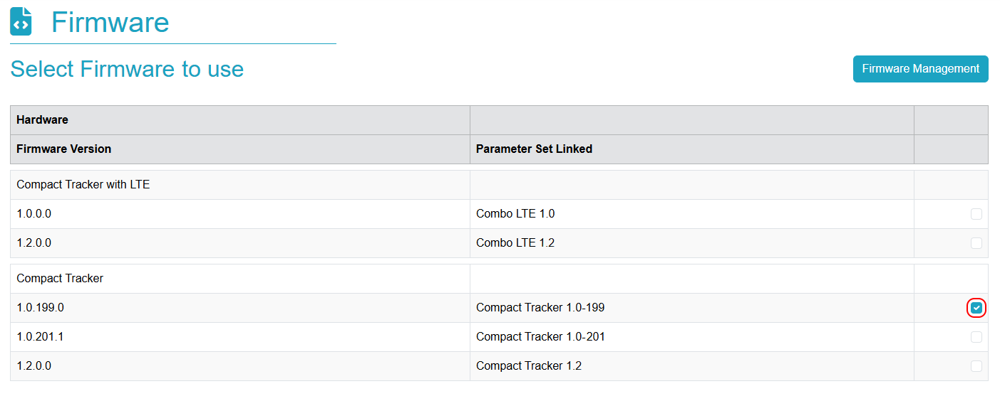
<figcaption>
Figure 18 : Firmware selection
</figcaption>
</figure>

# Set up a Parameter Set

## V.1. Creating a Parameter Set, a Group and a Physical Parameter

From the home page, go to **Configuration and Parameters**. From here
you can see the list of existing Parameter Set or creating one using the
“plus” button at the right of the table.

<figure>
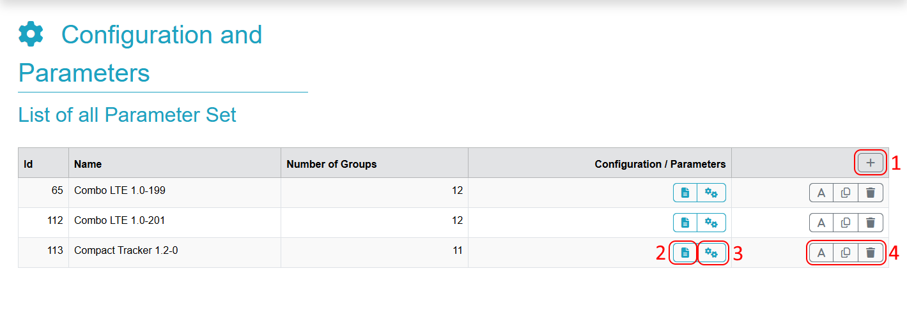
<figcaption>
Figure 19 : Parameter Set page
</figcaption>
</figure>

1.  Add a new Parameter Set

2.  See the Configuration link to this Parameter Set

3.  Modify the Parameter Set, such as adding Groups and Physical
    Parameter

4.  Other actions (rename, duplicate and delete)

The main action that you can proceed on a Parameter Set is to define his
Physical Parameter or creating a Configuration based on it. To create a
Physical Parameter, go to **Modify Parameters \[3\]** =\> **Add a new
Group** =\> **Add a new Physical Parameter**.

<figure>
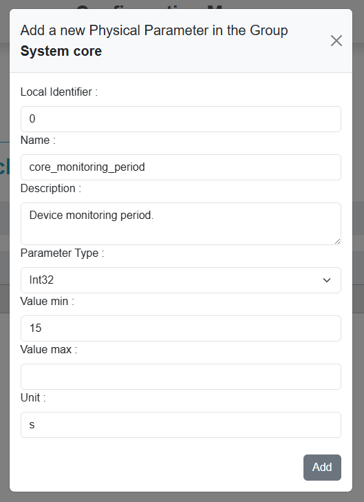
<figcaption>
Figure 20: Create a Physical Parameter
</figcaption>
</figure>

<figure>
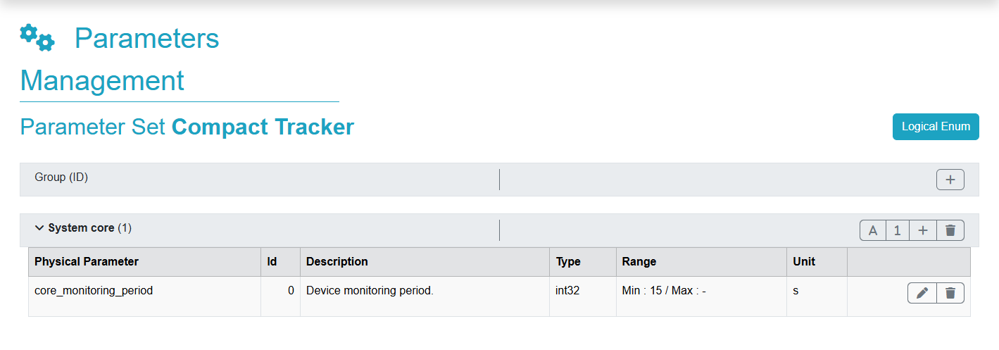
<figcaption>
Figure 21 : List a Physical Parameter from your Parameter
Set
</figcaption>
</figure>

## V.2. Link between the Parameter Set and a Configuration

If you create a Configuration from a new Parameter Set (click on **See
Configuration \[2\]** =\> **Add a new Configuration** =\> **Modify
Configuration**), this Configuration will be empty because no Physical
Parameters have been defined.

<figure>
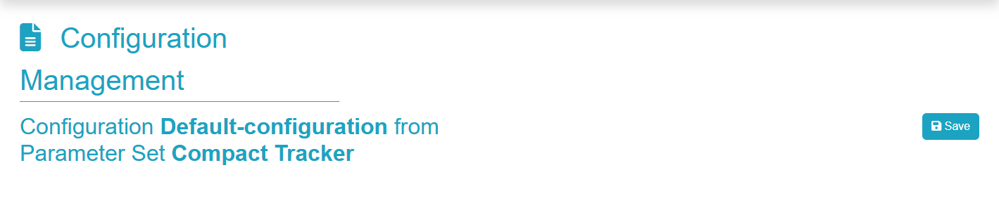
<figcaption>
Figure 22: Empty Configuration
</figcaption>
</figure>

Once you create a Physical Parameter for your Parameter Set, it will be
seen in the Configuration created earlier. Because Configurations and
the Parameter Set are linked, modifying the Parameter Set will
**automatically update** the Configuration generated.

<figure>
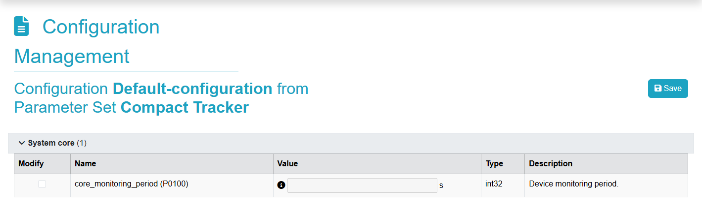
<figcaption>
Figure 23 : Updated Configuration
</figcaption>
</figure>

## 

## V.3. Physical Parameter Type

There are 3 types that you can apply to a Physical Parameter:

- Int32: A signed 32 bits integer

- Byte Array: A variable length array with a maximum size of 32 bytes

- String: in ASCII encoded, Null-terminated and with a maximum size of
  32 chars (including Null)

For the Int32 and the Byte Array, they can be selected as “bitfield”.
Bitfield parameters represent parameters that contain only specific
values, such as bit map or list. They are called Logical Parameter and
have to be defined in another page by clicking on the loop icon “**See
Logical Parameter**”.

<figure>
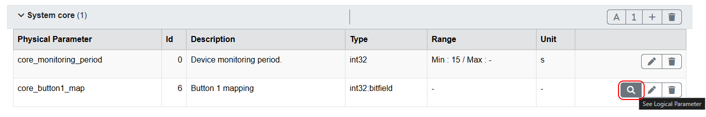
<figcaption>
Figure 24 : Access a Logical Parameter
</figcaption>
</figure>

## V.4. Logical Parameter and Enumeration

When you define a Logical Parameter, you can either set a Boolean or an
Enumeration. Boolean does not need any requirements, but Enumeration
must be defined beforehand in the **Logical Enum** page (**Modify
Parameters** =\> **Logical Enum**).

<figure>
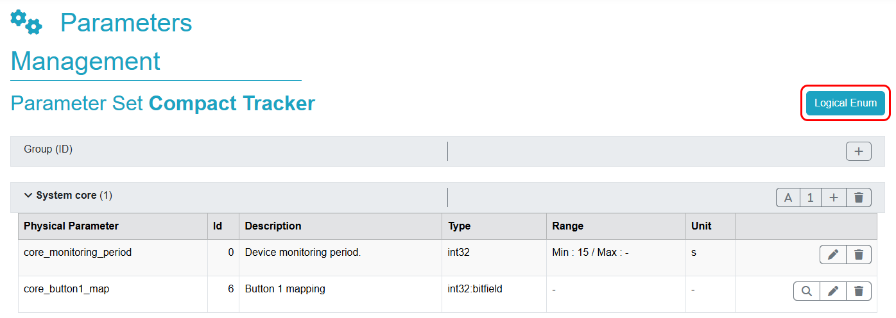
<figcaption>
Figure 25 : Access Logical Enum page
</figcaption>
</figure>

In the Logical Enum page, you can now set values for a specific
Enumeration (**Add a new Logical Enum** =\> **Add a new Logical Enum
Value**).

<figure>
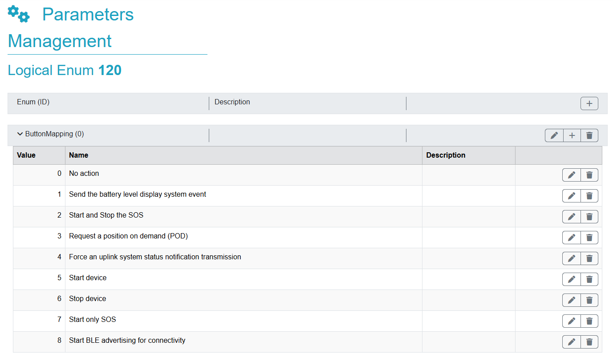
<figcaption>
Figure 26 : Enumeration for button
mapping
</figcaption>
</figure>

Once defined, this enumeration is now visible in the select list when
setting a Logical Parameter. The size of the enumeration (Enum bit start
and bit stop) depends on the number of values contained in it.

<figure>
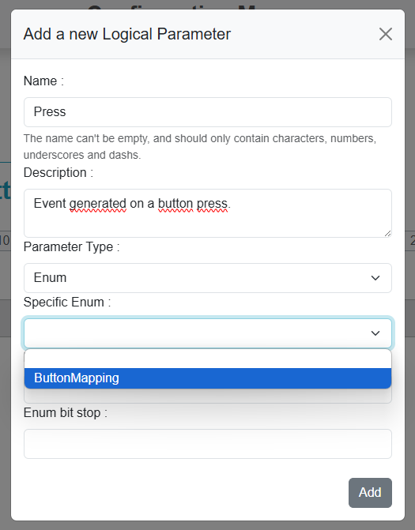
<figcaption>
Figure 27 : Select a specific enum
</figcaption>
</figure>

Finally, when you add a Boolean or an Enumeration, you can check the
amount of bit used in this Logical Parameter with the gauge on top of
the page (the bit used are highlighted by being darker).

<figure>
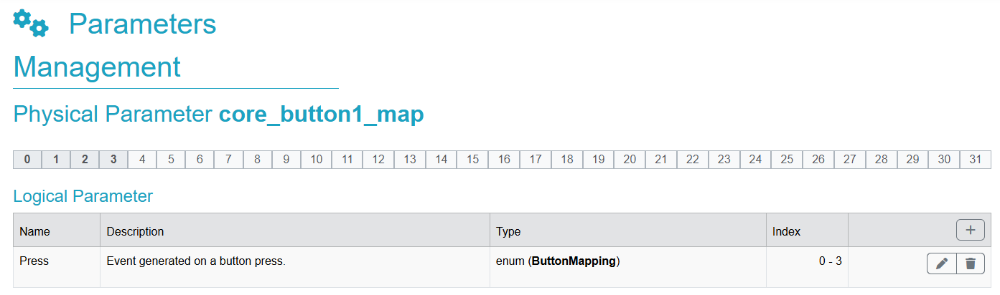
<figcaption>
Figure 28 : Int32 bitfield for button
mapping
</figcaption>
</figure>

# Set up a Configuration

## VI.1. Locked and unlocked Configuration

Configurations have 2 states possible: locked and unlocked.

- Unlocked Configuration: it’s the default state when creating a new
  Configuration. This state let you modify the value of Physical
  Parameters.

- Locked Configuration: once locked, the value of all Physical
  Parameters can’t be changed. Only Locked Configuration can be applied
  with the Configuration Manager, they are immutable, to keep the device
  state consistent and they can’t be deleted. Furthermore, a Locked
  Configuration can’t be unlocked.

<figure>
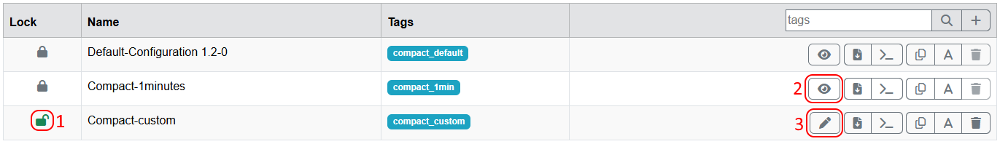
<figcaption>
Figure 29 : Locked and Unlocked
configurations
</figcaption>
</figure>

1.  Lock the Configuration.

2.  See the values of all Physical Parameters (Only for locked
    configurations).

3.  Modify the values of Physical Parameters (Only for unlocked
    configurations).

## VI.2. Configuration form scratch and inherited

When creating a new Configuration, you can create it from scratch, that
means that you must register all Physical Parameter, or you can create
it from another Configuration already set and be able to modify just a
few of them.

In the Configuration page (**See Configuration** =\> **Modify
Configuration**), each parameter has a checkbox call “**Modify**”. When
selected, you can configure the new value for the Physical Parameter. If
not, the value will be empty for Configuration from scratch and the same
as the parent Configuration for inherited.

<figure>
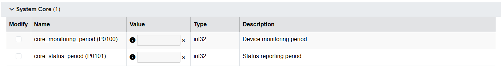
<figcaption>
Figure 30: Configuration from scratch, values are
empty
</figcaption>
</figure>

<figure>
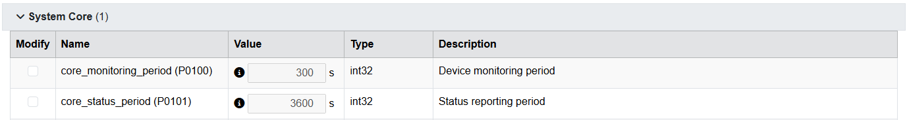
<figcaption>
Figure 31 : Inherited Configuration, values come from the
parent Configuration
</figcaption>
</figure>

A Configuration have to be saved by using the “**Save**” button on top
right of the page. You can register few Parameters part by part, save
your Configuration and continue to register other Physical Parameters
after that. Only locked Configuration are immutable, if your
Configuration isn’t locked, you can keep changing the values.

## VI.3. Apply a Configuration

Only Locked Configuration can be applied to a Device. Configuration are
managed by the tool and will be send automatically to the device via
LoRaWAN or directly using the serial or Bluetooth interface. Regardless
the method used (LoRaWAN or serial/Bluetooth), the tool will update
along the way the device state.

As explained above in the *III.3.1* and *III.3.2*, Configuration and
Device that share the same Firmware can be linked with a tag. If the
Device isn’t tagged or there is no Configuration tag corresponding to,
the default configuration registered for the common Firmware will be
applied. Link between a Configuration and a Device can be pictured as
follow:

<figure>
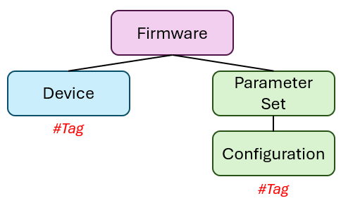
<figcaption>
Figure 32 : Link between Configuration and Device through
tags
</figcaption>
</figure>

# Device management

## VII.1. Register a new Device

From the home page, go to **Device Management**. From here you can see
the list of devices registered for your organization. You can see and
modify devices information or register a new one:

<figure>
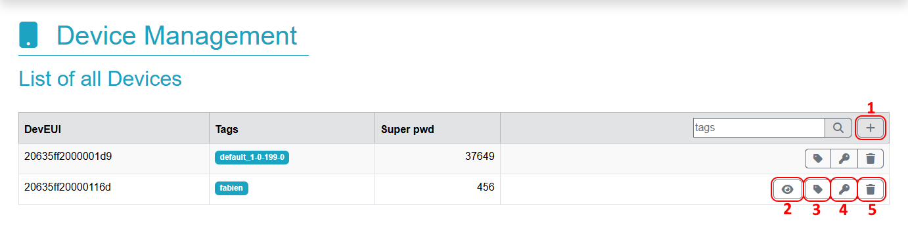
<figcaption>
Figure 33 : Device Management page
</figcaption>
</figure>

1.  Add a new device

2.  See the device state and the device history

3.  Change the tag for this device

4.  Modify the Super User Password (used for auto login when you connect
    with Serial or Bluetooth)

5.  Delete the device

## VII.2. Check the Device state and the Device history

By clicking the button “**See device info**” on a device, you can
display containing multiple information:

<figure>
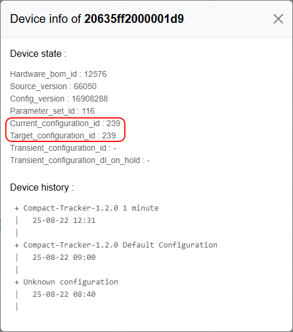
<figcaption>
Figure 34 : Device Information
</figcaption>
</figure>

In this example, we can see from the “Device history” that our device
has been through 3 different Configuration:

- An Unknown configuration, when we registered the device

- The default configuration for Compact Tracker, that has been
  downloaded because it was in an unknown configuration

- And finally, the “1 minute” configuration that has been given by
  tagging our device

In the “Device state”, we can see that the Current Configuration and the
Target Configuration are the same, that means that our device is up to
date, and thanks to the device history we can know which configuration
is loaded in our device.

# Using Serial and Bluetooth

## VIII.1. Using the Serial and Bluetooth interface

Either on the Bluetooth or Serial page, you can perform those functions:

<figure>
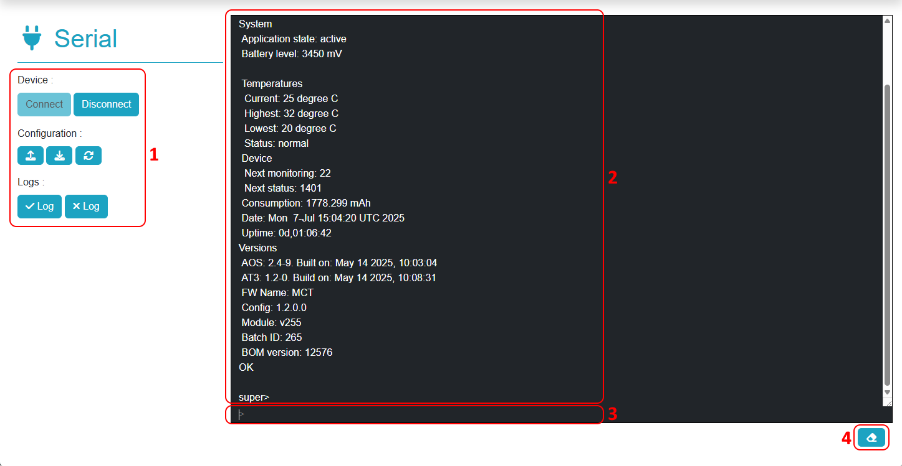
<figcaption>
Figure 35 : Serial interface
</figcaption>
</figure>

1.  Access different action

2.  CLI console print

3.  CLI command input

4.  Clear the console

## VIII.2. Connect a Device through Serial

The Serial page is accessible via the home page. From here, connect your
Device with USB micro-B and click on **Connect**. This will trigger a
pop-up page with the list of all USB, AT3 Device will be identify as
**STM32 Virtual ComPort**.

<figure>
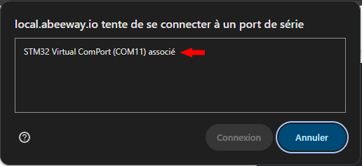
<figcaption>
Figure 36 : Pop-up serial connection
</figcaption>
</figure>

## VIII.3. Connect a Device through Bluetooth

The Bluetooth page is accessible via the home page. But to be able to
connect the device using Bluetooth, you have to register the device on
your computer, following those steps:

- Enable “**Show more devices**” in the Bluetooth search menu.

- AT3 will appear as “**ABF**” + the last **5 bytes** of your device.

- Link the device to your computer.

After that, go to the Bluetooth page and click to **Connect**. The
device will appear with the same name as the Bluetooth search menu ABF +
5 bytes.

<figure>
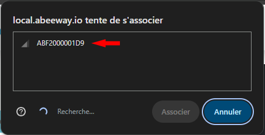
<figcaption>
Figure 37 : Pop-up Bluetooth connection
</figcaption>
</figure>

It may be occurred that the connection with Bluetooth services fail
during the connection. If so, a message will display on the end of page,
and you will just need to try again to connect.

<figure>
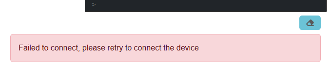
<figcaption>
Figure 38 : Error message from Bluetooth
connection
</figcaption>
</figure>

## VIII.4. Using the CLI

When using the AT3 CLI (Command Line Interface) the first thing to do is
to log in as user or super user:

- For Super User, the password is the last 2 bytes from the LRUID
  translated in decimal. For example, if my last 2 bytes are 0x1234, my
  Super User password will be “*4660*”.

- For User, the password is defined in a Configuration Parameter, but
  mainly it will be “*123*”.

Once connected, you can write commands by using the last line of the
console (item 3 in “*Figure 35 : Serial interface*”).

When your connected to the device with Bluetooth, you have to enable the
CLI to communicate with it. This feature isn’t enabled directly because
you can perform action by using Bluetooth services only.

## VIII.5. Check for Configuration and update the device state

Memorizing the device Configuration state is one of the main features in
ConfMan. When you connect a Device using Serial or Bluetooth interface,
you can check directly the Configuration loaded in the Device.

<figure>
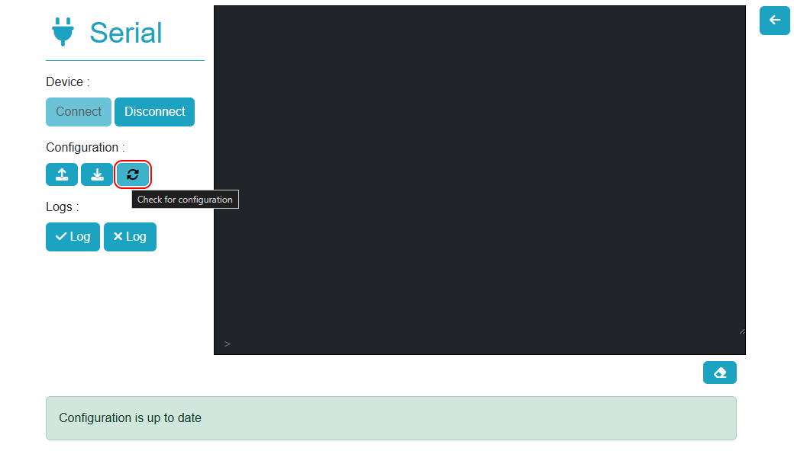
<figcaption>
Figure 39 : Check for Configuration
</figcaption>
</figure>

Checking the Configuration will search in the tool, if the Device is
registered, a Configuration that share the same Firmware and with the
same tag and compare it to the Configuration read. If the Device isn’t
tagged, it will compare the Configuration read with the default
Configuration for this Firmware.

If the two Configurations are different, the tool will ask for updating
it. By doing that, it will update the device state the same way that the
tool does with LoRaWAN frame.

## VIII.6. Import / Export the device configuration

From the Serial and Bluetooth page, you can directly load a
Configuration in the device:

<figure>
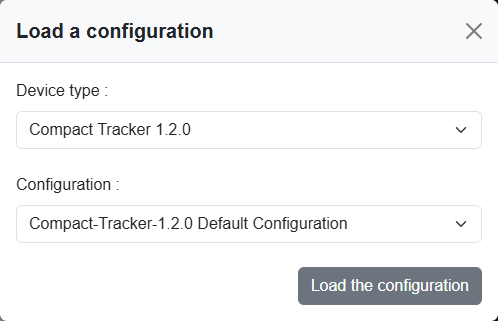
<figcaption>
Figure 40 : Load a Configuration
</figcaption>
</figure>

You can also download the Configuration from the device and saved it in
the database:

<figure>
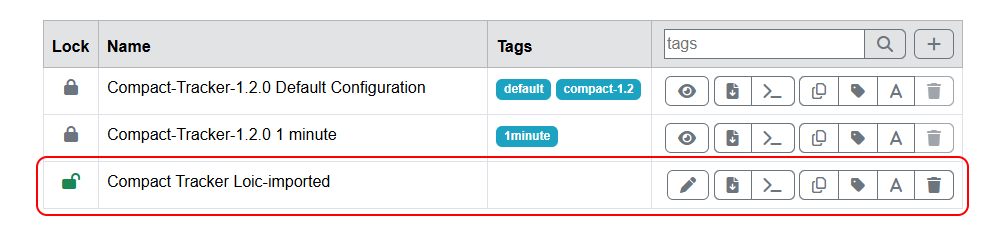
<figcaption>
Figure 41 : Downloaded Configuration
</figcaption>
</figure>
